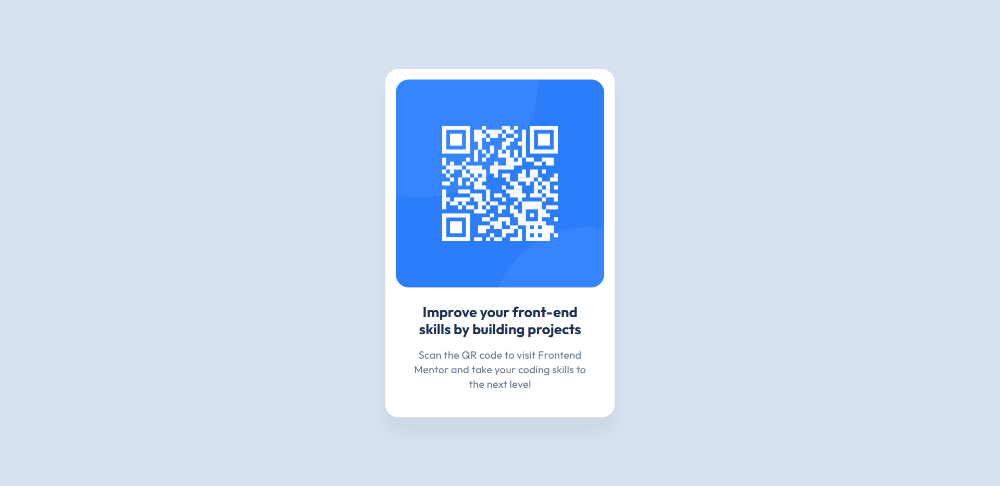

# Frontend Mentor - QR code component solution

This is a solution to the [QR code component challenge on Frontend Mentor](https://www.frontendmentor.io/challenges/qr-code-component-iux_sIO_H). Frontend Mentor challenges help you improve your coding skills by building realistic projects.

## Table of contents

- [Overview](#overview)
  - [Screenshot](#screenshot)
  - [Links](#links)
- [My process](#my-process)
  - [Built with](#built-with)
  - [Useful resources](#useful-resources)
- [Author](#author)

## Overview

This is a solution to the [QR code component challenge on Frontend Mentor](https://www.frontendmentor.io/challenges/qr-code-component-iux_sIO_H). The goal was to build a responsive card featuring a QR code, styled to match the given design.

### Screenshot

### Links

- Solution URL: [solution URL here](https://www.frontendmentor.io/solutions/qr-code-component-with-html-and-css-YLji1kENHf)
- Live Site URL: [live site URL here](https://zzz-ren.github.io/Frontend-mentor-qr-code-component/)

### My process

### Built with

- Semantic HTML5 markup
- CSS custom properties

### Useful resources

- [W3 Schools](https://www.w3schools.com/css/) - This helped me for CSS related queries.

## Author

- Website - [Dhiren Rathod](https://www.dhiren.thenetnexus.com)
- Frontend Mentor - [@zZz-ren](https://www.frontendmentor.io/profile/zZz-ren)
